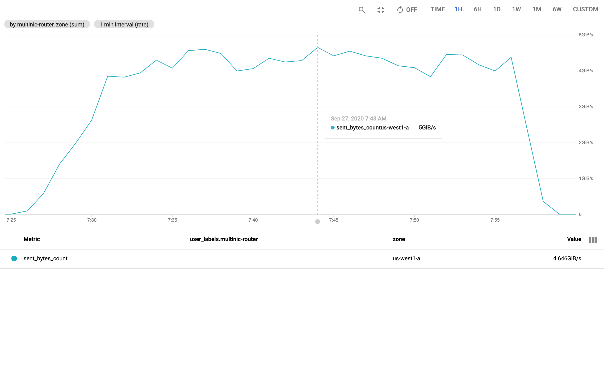
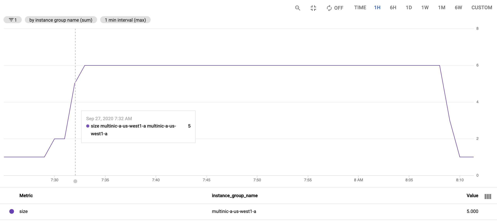
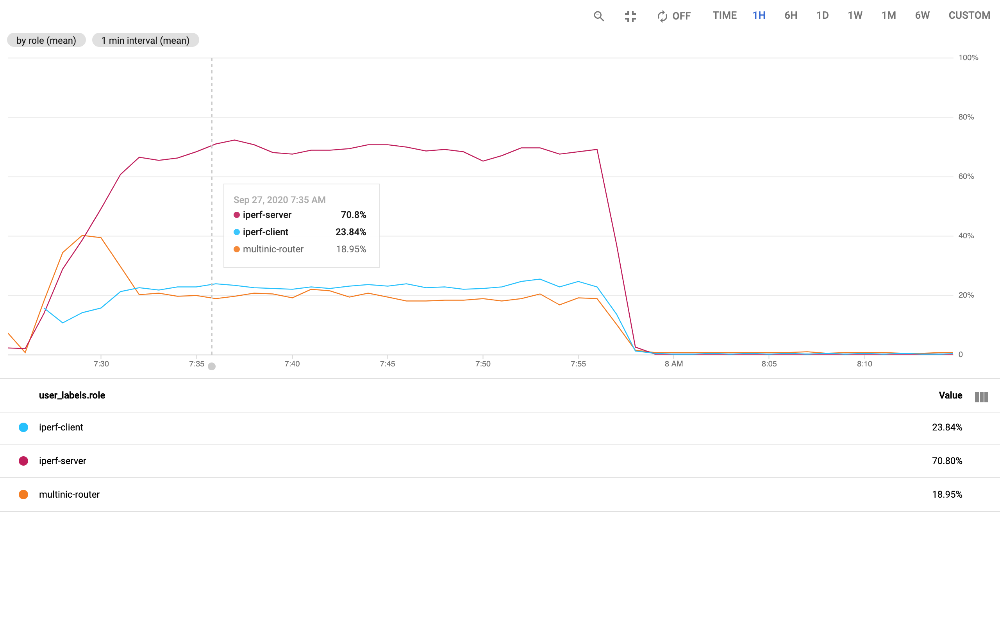
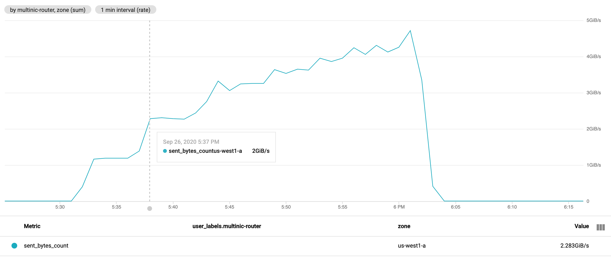
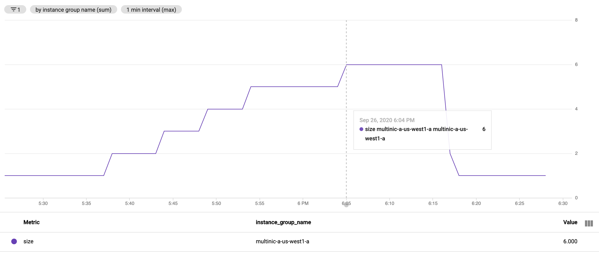
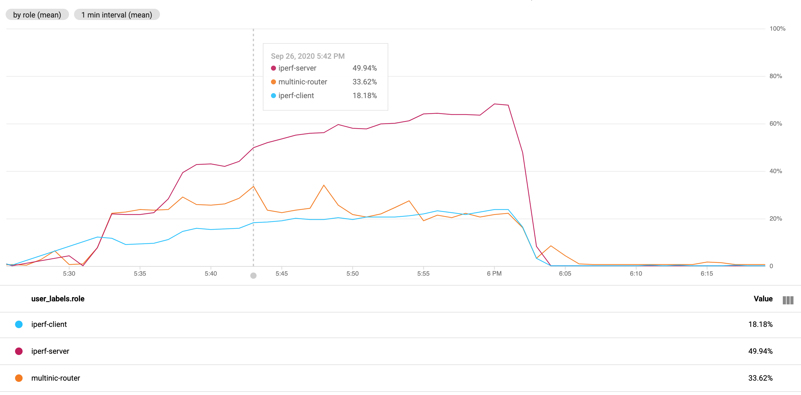

Managed Instance Group Autoscaler
===

Summary
---

 * CPU Autoscaler scales out from 1 to 6 instances in ~6 minutes.
 * `sent_bytes_count` Autoscaler scales out from 1 to 6 instances in ~30 minutes.
 * `n1-highcpu-2` machine types are recommended for multinic instances to
   support 10Gbps per instance.
 * CPU usage per n1-highcpu-2 multinic instance is ~22-24% when sending at
   10Gbps.
 * Autoscaler target of 20% CPU Utilization is recommended.

Test Setup
---

 * 1x `n1-highcpu-2` multinic router at the start.  (10Gbps)
 * 1x `n2-standard-4` [iperf-server](#iperf-server)
 * 6x [iperf-clients](#iperf-client)

Over the 30 minute test run time, measure:

 1. Time to scale out
 2. Aggregate throughput of the multinic instances
 3. Time to scale in

## <a name="CPU"></a> CPU Autoscaler

The CPU based autoscaler targets 20% utilization for each multinic instance.
At 20% CPU utilization of a `n1-highcpu-2` instance, the 10Gbps of bandwidth is
approximately 80% utilized.

Scale out:

| Time    | Note                                                    |
| ----    | ----                                                    |
| t0      | Start 6 iperf clients (~60Gbps send rate)               |
| +2m16s  | Autoscaler moves from 1 to 2 instances                  |
| +4m10s  | Autoscaler moves from 2 to 5 instances                  |
| +6m06s  | Autoscaler moves from 5 to 6 instances                  |
| +11m47s | The autoscaler cannot add more instances. (Max Reached) |

Scale in:

| Time   | Note                                                             |
| ----   | ----                                                             |
| t0     | iperf clients stop sending, multinic send rate drops below 1Mbit |
| +8m48s | Autoscaler moves from 6 to 5 instances                           |
| +8m58s | Autoscaler moves to 4 instances                                  |
| +9m08s | Autoscaler moves to 3 instances                                  |
| +9m16s | Autoscaler moves to 2 instances                                  |
| +9m29s | Autoscaler moves to 1 instance                                   |

## <a name="sent_bytes_count"></a> `sent_bytes_count` Autoscaler

The `instance/network/sent_bytes_count` based autoscaler targets `939524096`
bytes per second, which is 70% of 10Gbps for each `n1-highcpu-2` multinic
instance.

Scale out:

| Time    | Note                                           |
| ----    | ----                                           |
| t0      | 5:32 Start 6 iperf clients (~60Gbps send rate) |
| +3m56s  | Autoscaler moves from 1 to 2 instances         |
| +9m24s  | Autoscaler moves from 2 to 3 instances         |
| +14m53s | Autoscaler moves from 3 to 4 instances         |
| +20m18s | Autoscaler moves from 4 to 5 instances         |
| +31m19s | Autoscaler moves from 5 to 6 instances         |

Scale in:

| Time    | Note                                                                     |
| ----    | ----                                                                     |
| t0      | 6:03 PM iperf clients stop sending, multinic send rate drops below 1Mbit |
| +12m14s | Autoscaler moves from 6 to 5 instances                                   |
| +13m17s | Autoscaler moves to 3 instances                                          |
| +13m01s | Autoscaler moves to 2 instances                                          |
| +13m18s | Autoscaler moves to 1 instance                                           |

## <a name="CPU_graphs"></a> CPU Autoscaler Graphs

Multinic aggregate sent bytes per second



Multinic instance group size



CPU Utilization



## <a name="sent_bytes_count_graphs"></a> `sent_bytes_count` Autoscaler Graphs

Multinic aggregate sent bytes per second



Multinic instance group size



CPU Utilization



Example
---

Start with a single multinic instance running in a single zone.

```bash
gcloud compute instances list --filter="name~^multinic"
```
```
NAME             ZONE        MACHINE_TYPE  PREEMPTIBLE  INTERNAL_IP          EXTERNAL_IP  STATUS
multinic-a-wf14  us-west1-a  n1-highcpu-2  true         10.33.0.7,10.37.0.7               RUNNING
```

Create the iperf-server endpoint on the east side of the routers:

```bash
# examples/endpoints/
terraform apply -var num_instances_east=1
```

Obtain the IP address of the iperf-server:

```
IP=$(gcloud compute instances list --filter="name~^endpoint-main" --format="value(networkInterfaces[0].networkIP)")
```

Start the iperf clients to generate network traffic through the routers.  Note,
this command will generate a large amount of network traffic.  Verify the
clients, routers, and servers are all in the same zone to reduce zone egress
charges.

```bash
terraform apply -auto-approve -var iperf_client=${IP} -var num_instances_east=1 -var num_instances=6
```

For the next 30 minutes, each client will try to connect to the server at `$IP`
every 10 seconds.  Multiple, short, runs are used to keep constant upward
pressure on the multinic routers.

Helpful Commands
---

List the number of multinic instances and the last autoscaler event:

```bash
gcloud compute instances list --filter=name~^multinic
gcloud beta logging read "resource.type=gce_autoscaler" --limit=1
```

Notes
===

Appendix
===

## Intentions

A `n1-highcpu-2` machine type is used for multinic-router instances to handle
10Gbps of traffic.

A `n2-standard-4` machine type is used for the iperf-server endpoint
`multinic-main` to handle upwards of 50Gbps from multiple iperf clients.

A `n1-highcpu-2` machine type is used for iperf-clients to generate up to
10Gbps per client.


## <a name="iperf-client"></a> iperf-client

```bash
# 30 minutes, x*10 second runs.
local x=180
if [[ -n "${IPERF_CLIENT}" ]]; then
  while [[ $x -gt 0 ]]; do
    ((x--))
    # Restart the client to reset the TCP window size to create pressure on the network.
    iperf --parallel 128 --time 10 -i 1 --client "${IPERF_CLIENT}" | tee /var/log/iperf.log
  done
fi
```

## <a name="iperf-server"></a> iperf-server

```
[Unit]
Description=iperf server
After=network-online.target
Wants=network-online.target

[Service]
Type=simple
ExecStart=/usr/bin/iperf --server --interval 5
Restart=on-abort

[Install]
WantedBy=multi-user.target
```

## Inspecting Autoscaler Logs

`gcloud` may be used to inspect the autoscaler logs and changes in near real
time:

```
+ gcloud compute instances list '--filter=name~^multinic'
NAME             ZONE        MACHINE_TYPE  PREEMPTIBLE  INTERNAL_IP            EXTERNAL_IP  STATUS
multinic-a-2tzr  us-west1-a  n1-highcpu-2  true         10.33.0.21,10.37.0.21               RUNNING
multinic-a-c96w  us-west1-a  n1-highcpu-2  true         10.33.0.20,10.37.0.20               RUNNING
multinic-a-l28p  us-west1-a  n1-highcpu-2  true         10.33.0.25,10.37.0.25               RUNNING
multinic-a-q8kp  us-west1-a  n1-highcpu-2  true         10.33.0.22,10.37.0.22               RUNNING
multinic-a-r4qc  us-west1-a  n1-highcpu-2  true         10.33.0.26,10.37.0.26               RUNNING
multinic-a-sqbn  us-west1-a  n1-highcpu-2  true         10.33.0.24,10.37.0.24               RUNNING
+ gcloud beta logging read resource.type=gce_autoscaler --limit=1
---
insertId: 148tet9ggdt2fx7
jsonPayload:
  '@type': type.googleapis.com/autoscaler.AutoscalerStatusChange
  autoscalerName: multinic-a-us-west1-a
  instanceGroupName: multinic-a-us-west1-a
  newStatus:
    details: OK
  oldStatus:
    details: The number of instances in the instance group has reached the max_num_replicas.
      The autoscaler cannot add more instances.
  projectId: multinic-networks-18d1
  zoneName: us-west1-a
logName: projects/multinic-networks-18d1/logs/autoscaler.googleapis.com%2Fstatus_change
receiveTimestamp: '2020-09-27T14:44:30.829289132Z'
```
